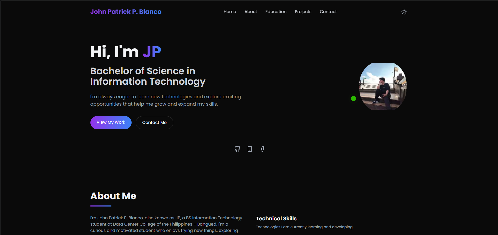

# 👨🏻‍💻 John Patrick Blanco — Web Developer Portfolio

A modern, responsive personal portfolio website built for **John Patrick P. Blanco**, a BS Information Technology student and aspiring full-stack web developer. The site showcases skills, education, projects, and a clear way for visitors to get in touch.



---

## ✨ Features

- ⚡ **Fast & SEO-friendly** – Next.js static generation for optimal performance
- 🎨 **Smooth animations** – Page transitions and hover effects powered by Framer Motion
- 📱 **Fully responsive** – Seamless experience on mobile, tablet, and desktop
- 🧭 **Single-page navigation** – Smooth-scroll sections for Home, About, Education, Projects, and Contact
- 💼 **Project showcase** – Highlights academic and web development work
- 🌙 **Dark-mode friendly** – Tailwind-powered theming across the UI

---

## 🚀 Tech Stack

| Layer       | Technology                                                                 |
|-------------|----------------------------------------------------------------------------|
| Framework   | [Next.js](https://nextjs.org/)                                             |
| Language    | [TypeScript](https://www.typescriptlang.org/)                              |
| Styling     | [Tailwind CSS](https://tailwindcss.com/)                                   |
| Animations  | [Framer Motion](https://www.framer.com/motion/)                            |
| Icons       | [React Icons](https://react-icons.github.io/react-icons/)                  |
| Deployment  | [Vercel](https://vercel.com/)                                              |

---

## 📂 Project Structure

```
app/
├── components/          # UI sections (Hero, About, Projects, CTA, Footer, etc.)
├── lib/                 # Constants, skill data, and animation variants
├── utils/               # Helper utilities (smooth scroll)
├── globals.css          # Global styles
├── layout.tsx           # Root layout
└── page.tsx             # Single-page entry point
```

---

## 📦 Getting Started

### Prerequisites

- [Node.js](https://nodejs.org/) (v18 or later)
- npm (included with Node.js)

### Installation

Clone the repository:

```bash
git clone https://github.com/johnpatrickblanco/web-dev-portfolio
```

Navigate into the project directory:

```bash
cd web-dev-portfolio
```

Install dependencies:

```bash
npm install
```

Start the development server:

```bash
npm run dev
```

Open [http://localhost:3000](http://localhost:3000) in your browser.

### Production Build

```bash
npm run build
npm run start
```

---

## 🛠️ Customization

- **Personal info, skills & social links** – edit `app/lib/constants.ts`
- **Animations** – tweak variants in `app/lib/animations.ts`
- **Sections** – modify individual components in `app/components/`
- **Theme & styling** – adjust classes in `tailwind.config.ts` and `app/globals.css`

---

## 📖 Documentation

- [`docs/PROJECTS.md`](./docs/PROJECTS.md) – Academic projects, including the Casa Nostra Resort System and Bayugo Dental Clinic Record Management System.

---

## 💌 Get In Touch

Have a question, a project idea, or want to collaborate? Feel free to reach out:

[](https://www.facebook.com/johnpatrick.blanco.33/)
[](https://github.com/johnpatrickblanco)


---

## 📄 License

This project is for personal use. Feel free to use it as inspiration for your own portfolio.
